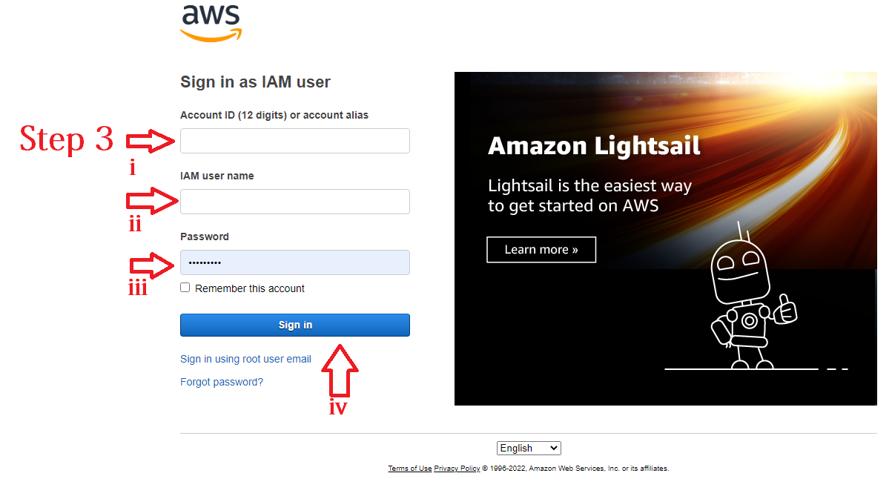
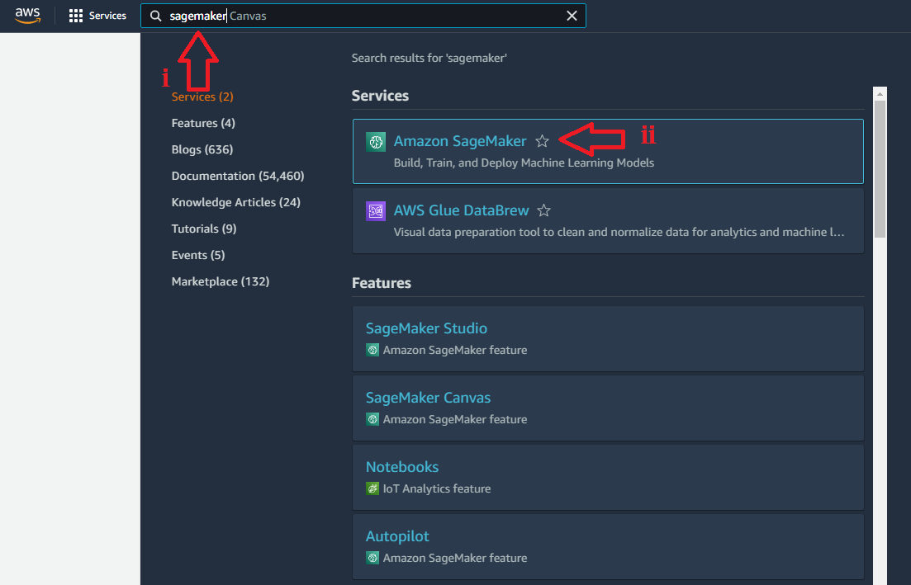

# Configure SageMaker

SageMaker is an aws Service that you can use for Jupyter like notebooks.

## Installation

Please follow the step-by-step instruction to configure SageMaker

### Step1
first, go to www.aws.amazon.com 

### Step2
second, 

### Step3

### Step4

### Step5

### Step6

