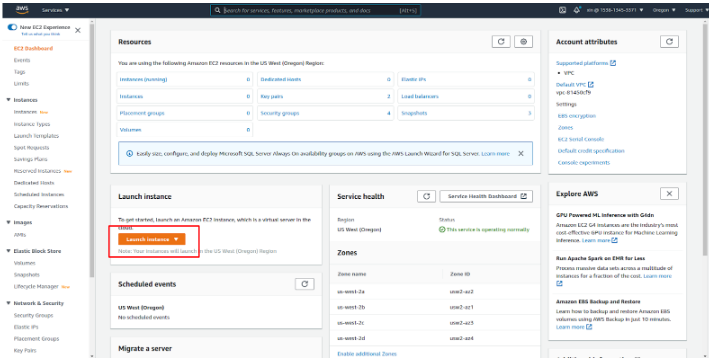
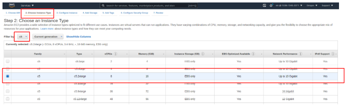
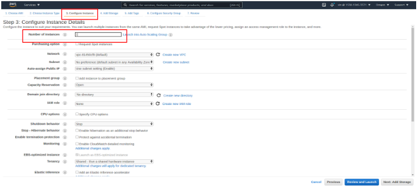
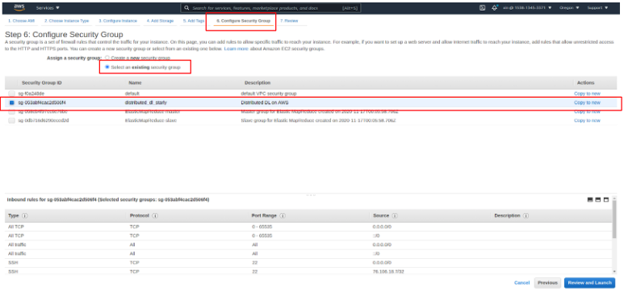
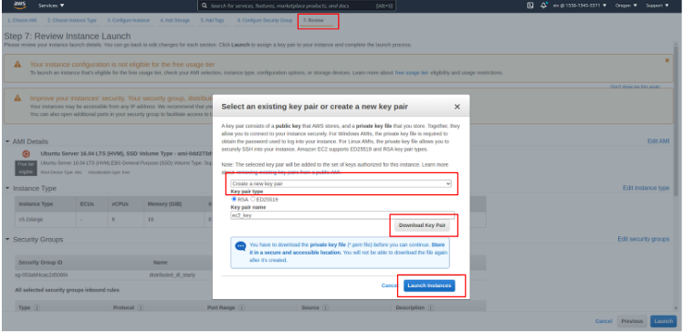
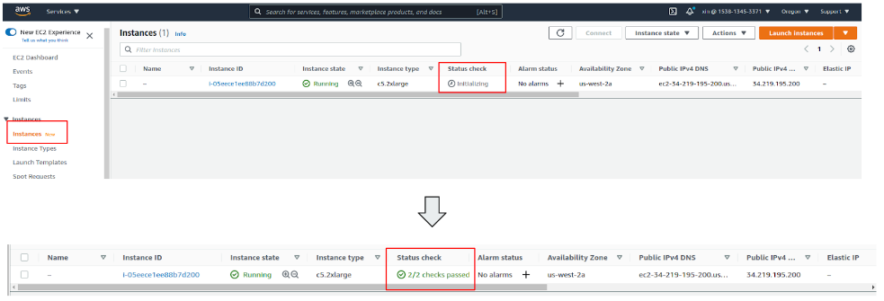
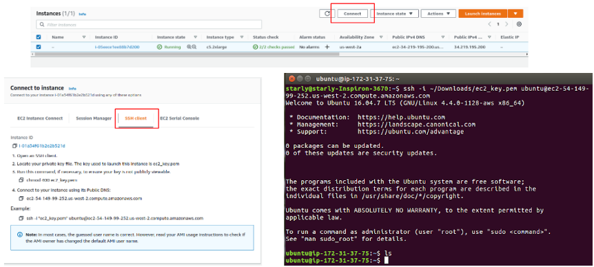
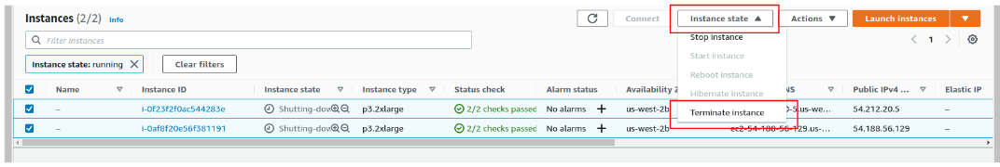

# Web based Execution with Script

1. Launch instances on [EC2 console](https://us-west-2.console.aws.amazon.com/ec2/v2/home):   
<p align="center"></p><br/>

2. Choose an Amazon Machine Image (AMI)  
  An AMI is a template that contains the software configuration (operating system, application server, and applications) required to launch your instance.
  For CPU applications, we use **Ubuntu Server 16.04 LTS (HVM), SSD Volume Type**.  

  

3. Choose an Instance Type  
Based on your purpose, AWS provides various instance types on [https://aws.amazon.com/ec2/instance-types/](https://aws.amazon.com/ec2/instance-types/). For CPU application, we recommand to use c5.2xlarge instance.
<p align="center"></p><br/>

4. Configure Number of instances  
We use 1 instance for single machine computation.
<p align="center"></p><br/>

5. Configure Security Group
<p align="center"></p><br/>

6. Review, Create your SSH key pair, and Launch
<p align="center"></p><br/>

7. View your Instance and wait for Initialing
<p align="center"></p><br/>

8. SSH into your instance
<p align="center"></p><br/>

9. Copy [bootstrap.sh](bootstrap.sh) to your instance, and run the script
```bash
sudo bash bootstrap.sh
```

10. Run ML CPU application:

    ```bash
    cd ML_based_Cloud_Retrieval_Use_Case/Code && /usr/bin/python3.6 ml_based_cloud_retrieval_with_data_preprocessing.py
    ```

16. Terminate the virtual machine on EC2 when finishing experiments.
<p align="center"></p>

