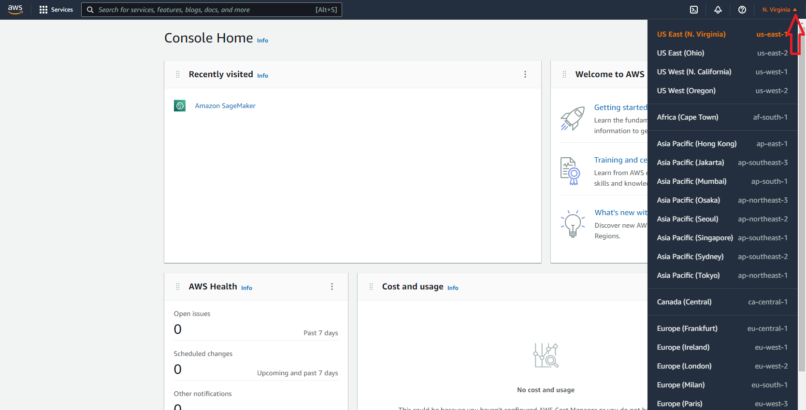
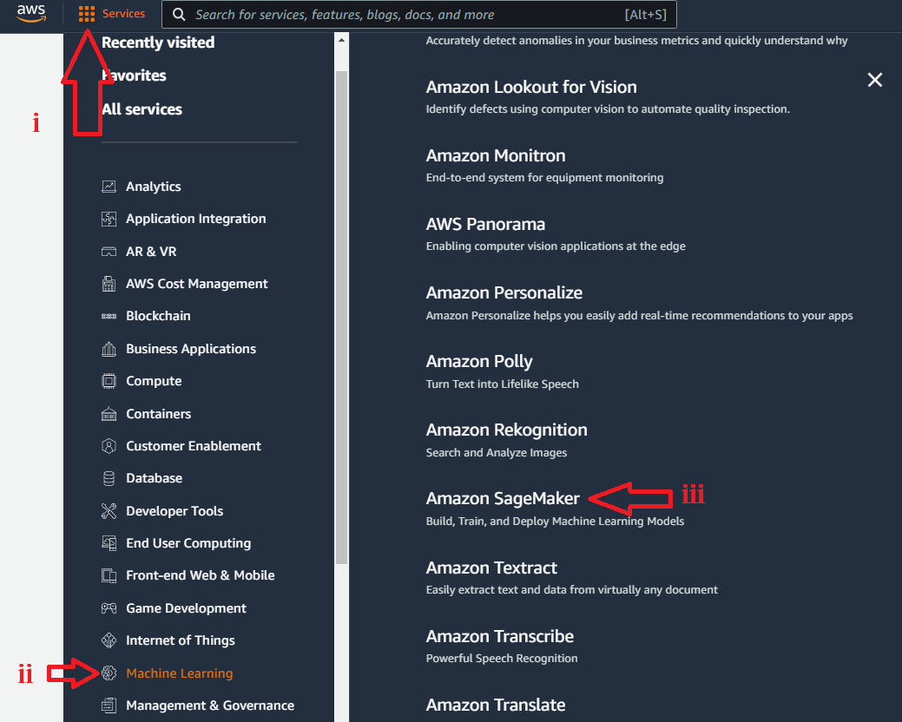
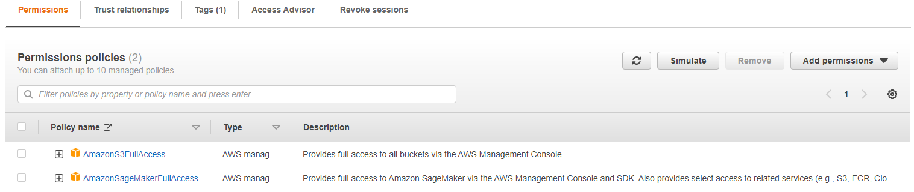
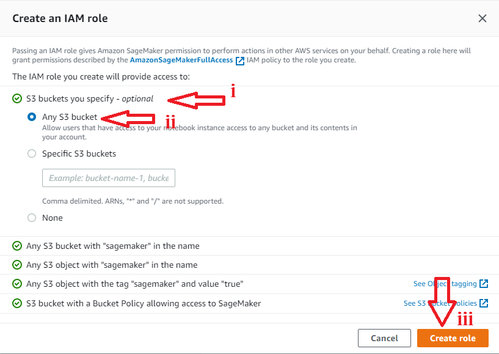

# Configure SageMaker

SageMaker is an aws Service that allows you to use notebooks (like jupyter notebooks).

## Installation

Please follow the step-by-step instruction to configure SageMaker

### Step1

First, go to **www.aws.amazon.com** then click **sign in** to the console (on top right corner). Use your credentials (username, password, etc.) to login to the aws console.

### Step2

Once you are logged in, you should select the right **Region** (on top right corner) to make sure you are using all other related services or your team are in the same region. If this is a new account, default region is okay but next services onwards should be in the same region.

### Step3

Now, you can click the **Services** _(with 9 dots)_ and choose **Machine Learning** from the dropdown. Then, click on the **Amazaon SageMaker** on the right side of the window to enter into the SageMaker page. Alternatively, you can type **sagemaker** in the search box _(second image)_, and you can click on the **Amazon SageMaker**. It will do the same.

### Step4

Great! you are in SageMaker console. To get a notebook started, click on the **Notebook** in the left panel and you will see **Notebook instances**. Then, on the top right corner you need to click on the orange button saying **Create notebook instance**.

### Step5

In this part, you have to do 3 things. At first _i)_ give a notebook instance name _(please note: this name has to be unique in the selected region, otherwise it will through errors)_. The next is you have to select a _(ii)_ Notebook instance type, that allows you to select the type of instance of your choice. Finally, an _(iii)_ IAM role should be selected or created. 

***Please note:*** you can create a new IAM role _(described in the next step)_ or your can select a predefined role _(if you already have one)_.

#### _Note related to Step5_

If you want to choose from a predefind role, make sure it is attached to the _Policy_ called **AmazonSageMakerFullAccess** and **AmazonS3FullAccess**. Creating a new IAM role automatically adds the policy **AmazonSageMakerFullAccess** by default.

### Step6

**If you are creating a new IAM role, followin this step, otherwise skip and go to next step**.

At this point you should go with the default one, which is _(ii)_ Any S3 bucket. It is good as it allows to access any S3 bucket. Next, you can click on the **Create role** button which will create an IAM Role and attach to Policy to SageMaker.

