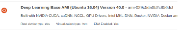

# Web based Execution of a Single GPU with Docker     

1. Launch instances on [EC2 console](https://us-west-2.console.aws.amazon.com/ec2/v2/home):   
<p align="center"></p><br/>

2. Choose an Amazon Machine Image (AMI)  
An AMI is a template that contains the software configuration (operating system, application server, and applications) required to launch your instance.
For GPU case, we use **Deep Learning Base AMI (Ubuntu 16.04) Version 40.0** in "Community AMIs".  
<p align="center"></p><br/>

3. Choose an Instance Type  
Based on your purpose, AWS provides various instance types on [https://aws.amazon.com/ec2/instance-types/](https://aws.amazon.com/ec2/instance-types/). For GPU application, we recommand to use p3.2xlarge instance.


4. Configure Number of instances  
We use 1 instance for single machine computation.
<p align="center"></p><br/>

4.5 (Optional)Add Storage
Add additional storage to your instance if needed.

5. Configure Security Group
<p align="center"></p><br/>

6. Review, Create your SSH key pair, and Launch
<p align="center"></p><br/>

7. View your Instance and wait for Initialing
<p align="center"></p><br/>

8. SSH into your instance
<p align="center"></p><br/>

9. Copy [bootstrap.sh](bootstrap.sh) to your instance, and run the script
```bash
sudo bash bootstrap.sh
```


10. Install [Docker](https://docs.docker.com/engine/install/ubuntu/)
```bash
curl -fsSL https://get.docker.com -o get-docker.sh
sudo sh get-docker.sh
sudo service docker start
sudo usermod -a -G docker ubuntu
sudo chmod 666 /var/run/docker.sock
```
<br/>

11. Download [Docker images](https://hub.docker.com/u/starlyxxx) or build images by Dockerfile.

```bash
docker pull starlyxxx/horovod-pytorch-cuda10.1-cudnn7
```
- or, build from Dockerfile:

```bash
docker build -t <your-image-name> .
```
<br/>

12. Download ML applications and data on AWS S3.
- For privacy, we store the application code and data on AWS S3. Install aws cli and [set aws credentials](https://console.aws.amazon.com/iam/home?#/security_credentials).
```bash
curl 'https://awscli.amazonaws.com/awscli-exe-linux-x86_64.zip' -o 'awscliv2.zip'
unzip awscliv2.zip
sudo ./aws/install
aws configure set aws_access_key_id your-access-key
aws configure set aws_secret_access_key your-secret-key
```
- Download ML applications and data on AWS S3.

  Download:

  ```bash
  aws s3 cp s3://kddworkshop/MultiGpus-Domain-Adaptation-main.zip ./
  aws s3 cp s3://kddworkshop/office31.tar.gz ./
  ```
  or
  ```bash
  wget https://kddworkshop.s3.us-west-2.amazonaws.com/MultiGpus-Domain-Adaptation-main.zip
  wget https://kddworkshop.s3.us-west-2.amazonaws.com/office31.tar.gz
  ```
  Extract the files:
  ```bash
  unzip MultiGpus-Domain-Adaptation-main.zip
  tar -xzvf office31.tar.gz
  ```
  <br/>

13. Run docker containers for GPU applications

- Single GPU:
```bash
nvidia-docker run -it -v /home/ubuntu/MultiGpus-Domain-Adaptation-main:/root/MultiGpus-Domain-Adaptation-main -v /home/ubuntu/office31:/root/office31 starlyxxx/horovod-pytorch-cuda10.1-cudnn7:latest /bin/bash
```
<br/>  

14. Run ML GPU application

```bash
cd MultiGpus-Domain-Adaptation-main
```
```bash
horovodrun --verbose -np 1 -H localhost:1 /usr/bin/python3.6 main.py --config DeepCoral/DeepCoral.yaml --data_dir ../office31 --src_domain webcam --tgt_domain amazon
```
<br/>

15. Terminate the virtual machine on EC2 when finishing experiments.

<p align="center"></p>
<br/>
